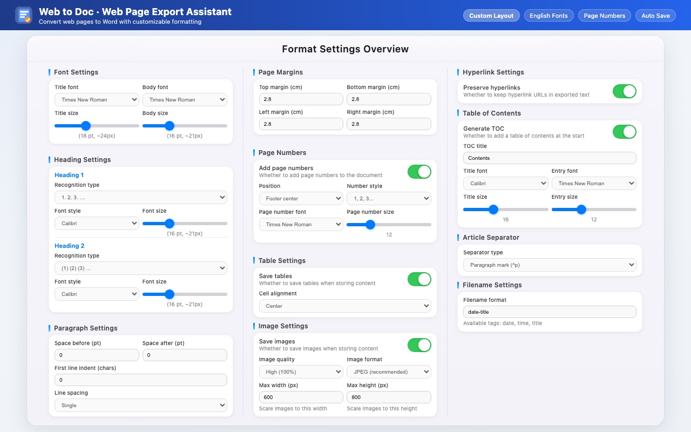

<b>English</b> · <a href="./README.zh_CN.md">中文</a>

<h1> Web to Doc</h1>

An open-source browser extension that exports selected webpage content to Word documents.

Keep text, tables, images, links, document styles, table of contents, and batch exports organized without repetitive copy-paste cleanup.

 

  

## Install

| Chrome | Microsoft Edge | Firefox |
|:---:|:---:|:---:|
| [Chrome Web Store](https://chromewebstore.google.com/detail/web-to-doc-%E7%BD%91%E9%A1%B5%E5%AF%BC%E5%87%BA%E5%8A%A9%E6%89%8B/mjahdeaaenjokdcfagekdlgjpndgljdp) | [Microsoft Edge Add-ons](https://microsoftedge.microsoft.com/addons/detail/web-to-doc-%E7%BD%91%E9%A1%B5%E5%AF%BC%E5%87%BA%E5%8A%A9%E6%89%8B/ciofekgnakfbnlbanlkeabhonaogpfhf) | [Firefox Add-ons](https://addons.mozilla.org/addon/web-to-doc-%E7%BD%91%E9%A1%B5%E5%AF%BC%E5%87%BA%E5%8A%A9%E6%89%8B/) |

You can also download the ZIP package from [GitHub Releases](https://github.com/FunYoung-code/web-to-doc/releases) and load it manually.

## Quick Start

Select text on a webpage, then click the floating **Export** button to generate a Word document.

  

## Features

- **One-click workflow:** Select webpage content and export it to Word with a simple floating toolbar.
- **Standard document styles:** Configure title and body fonts, font sizes, indentation, line spacing, margins, page numbers, and more.
- **Table preservation:** Detect webpage tables and rebuild them as Word tables.
- **Image export:** Capture body images and fit them to the document page width.
- **Link handling:** Preserve hyperlink text and optionally keep link formatting.
- **Table of contents:** Generate a document TOC and configure TOC font styles separately.
- **Smart file naming:** Combine date, title, department, category, and custom tags into export filenames.
- **Batch export:** Store multiple webpages, reorder them by drag-and-drop, and export them together.
- **Personal settings:** Configure site blacklist, auto storage, toolbar buttons, and shortcuts.

## Manual Installation

1. Download the release ZIP file.
2. Unzip it to a local folder.
3. Open your browser's extensions page and enable developer mode.
4. Load the unzipped folder.

For Chromium browsers, open `chrome://extensions/` and choose **Load unpacked**. For Firefox, open `about:debugging#/runtime/this-firefox` and load `manifest.json` temporarily.

## Privacy

Web to Doc is open source and the code is available for review.

- Web to Doc does **not** include account login, analytics SDKs, tracking scripts, or advertising code.
- Web to Doc does **not** upload selected webpage content to a remote server.
- Selected text, tables, images, export settings, language preference, and site blacklist are stored locally in the browser.
- To include webpage images in Word documents, the extension may request image resources from the current webpage and convert them locally.

## Permissions

- `storage`: saves export settings, temporary content, and site blacklist.
- `tabs`: reads current tab information to identify the active site.
- `<all_urls>`: shows the floating toolbar and reads user-selected webpage content.

## License

Web to Doc is released under the [GNU General Public License v3.0](./LICENSE).

Third-party open-source libraries are listed in [THIRD_PARTY_LICENSES.md](./THIRD_PARTY_LICENSES.md).

---

**Web to Doc · Turn webpages into clean Word documents.**

### Author Information

- **Author**: FunYoung
- **GitHub**: [https://github.com/FunYoung-code/web-to-doc](https://github.com/FunYoung-code/web-to-doc)
- **Feedback**: Issues and suggestions are welcome.
