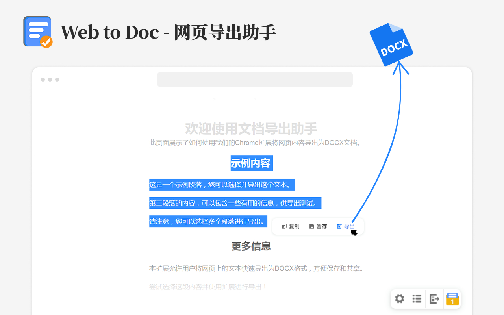

# Web to Doc - 网页导出助手

快速将网页内容导出为 Word 文档，自动适配格式、支持批量处理，解决网页复制格式错乱、手动排版耗时、文档归档混乱等办公难题。

## 使用方法和演示

### 使用方法

选中网页文本，点击悬浮工具栏中的“导出”按钮，即可导出 Word 文档。

### 使用演示

### 界面预览

## 主要功能

### 极简操作，轻松上手

集成格式设置、内容管理、文档导出三大按钮，布局清晰、一键触发，零门槛快速上手。

### 标准版式，智能适配

- 字体字号标准化：默认标题方正小标宋简体、二号，正文仿宋_GB2312、三号，并支持自定义调整。
- 页面段落规范化：首行缩进、行距、段间距、页边距、页码位置均可自由切换。
- 表格绘制精准化：智能识别抓取并还原表格样式。
- 图片处理批量化：抓取网页正文图片，并自动适配页面尺寸。
- 链接文本灵活化：可识别超链接文本，按需选择是否留存链接格式。
- 目录生成自动化：支持生成文档目录，并可单独设置目录字体样式。
- 文件命名智能化：支持日期、标题等标签自动组合命名，可自定义添加部门、文件类别等标识。

### 批量处理，提升效能

支持多篇网页内容统一收纳、拖拽调整排序，可一键批量导出统一格式的 Word 文档。

### 自主设置，效率加倍

可自定义网站禁用名单，按需配置自动暂存、操作快捷键等个性化参数，灵活适配不同使用习惯。

## 安装方法

### 方式一：通过浏览器应用商店安装

如果你喜欢“网页导出助手”，也欢迎在应用商店给一个五星鼓励，感谢支持。

- Chrome 拓展商店：[Web to Doc - 网页导出助手](https://chromewebstore.google.com/detail/web-to-doc-%E7%BD%91%E9%A1%B5%E5%AF%BC%E5%87%BA%E5%8A%A9%E6%89%8B/mjahdeaaenjokdcfagekdlgjpndgljdp)
- Edge 拓展商店：[Web to Doc - 网页导出助手](https://microsoftedge.microsoft.com/addons/detail/web-to-doc-%E7%BD%91%E9%A1%B5%E5%AF%BC%E5%87%BA%E5%8A%A9%E6%89%8B/ciofekgnakfbnlbanlkeabhonaogpfhf)
- Firefox 附加组件：[Web to Doc - 网页导出助手](https://addons.mozilla.org/addon/web-to-doc-%E7%BD%91%E9%A1%B5%E5%AF%BC%E5%87%BA%E5%8A%A9%E6%89%8B/)

### 方式二：离线安装扩展

1. 下载扩展文件安装包并解压。
   - 蓝奏网盘：https://funyoung.lanzn.com/b011m8z5ed
   - 密码：`52pj`
2. 打开浏览器“扩展程序”页面，并开启“开发者模式”。
3. 拖拽下载的扩展文件到浏览器，即可完成安装。

安装提示：如果是 ZIP 文件且拖拽无效，请先解压压缩包，再进行拖拽安装。

## 本地加载

1. 下载或克隆本仓库。
2. 在 Chromium 系浏览器打开 `chrome://extensions/`，开启“开发者模式”。
3. 点击“加载已解压的扩展程序”，选择本项目目录。

Firefox 可在 `about:debugging#/runtime/this-firefox` 中临时加载 `manifest.json`。

## 隐私说明

扩展会在用户主动暂存、复制或导出时读取当前页面中被选中的文本、表格和图片，用于生成 Word 文档。暂存内容、格式设置、网站禁用名单等数据保存在浏览器本地存储中。

项目代码未包含账号系统、统计 SDK 或远程服务器上传逻辑。为处理跨域图片，扩展可能会请求页面中的图片资源并在本地转换为文档内容。

## 权限说明

- `storage`：保存导出设置、暂存内容和网站禁用名单。
- `tabs`：获取当前标签页信息，用于识别当前网站。
- `<all_urls>`：在网页中显示悬浮工具栏，并读取用户选中的网页内容。

## 开源许可

本项目以 GNU General Public License v3.0 授权发布，详见 [LICENSE](LICENSE)。

项目中包含的第三方开源库仍遵循其各自许可证，详见 [THIRD_PARTY_LICENSES.md](THIRD_PARTY_LICENSES.md)。
